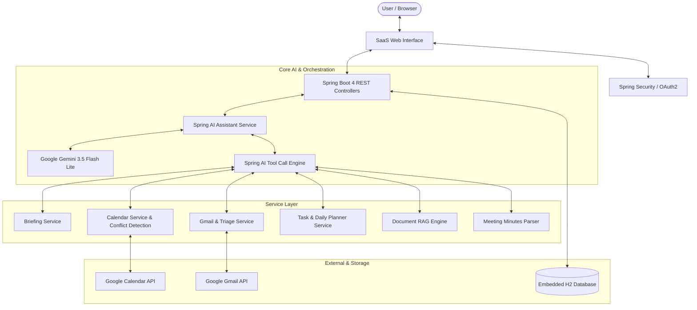

# OmniAssist — AI Executive Productivity Suite

OmniAssist is an enterprise-grade AI Productivity Suite and Autonomous Executive Assistant. Built on **Spring Boot 4**, **Spring AI**, **Google Gemini**, and the **Google Workspace APIs (Gmail & Calendar)**, OmniAssist combines proactive task automation, daily planning, inbox triage, meeting synthesis, and document intelligence into a single, cohesive workflow.

Designed with a modern SaaS aesthetic inspired by VEED.IO, the interface eliminates clutter and emojis in favor of crisp SVG line iconography, structured dashboards, and keyboard-accessible workflows.

---

## Architecture Overview



---

## Key Features

### 1. Modern SaaS Interface
- **Executive Productivity Hub (`Home`)**: Land directly on a clean, centralized workspace featuring quick action cards, today's schedule, priority deliverables, unread email triage, and an assistant dock.
- **Top-Right Settings Action Menu (`...`)**: Preferences, working hours, timezone configuration, and GDPR data export neatly consolidated into a header modal.
- **Zero-Emoji Design**: Monochrome SVG vector icons (Feather / Lucide style) provide a clean, professional aesthetic across all modules.
- **Responsive Navigation**: Streamlined sidebar accessing *Home*, *Chat*, *Tasks*, *Calendar*, *Mailbox*, and *Knowledge*.

---

### 2. Tier 1 & Tier 2 Advanced AI Capabilities

#### Tier 1: Proactive & Hands-Free
- **Automated Morning Executive Briefing**:
  - Automatically analyzes calendar meetings, pending tasks, and urgent deadlines.
  - Synthesizes an executive morning summary with a single-click audio readout.
- **Smart Calendar Time-Blocking**:
  - Automatically identifies open gaps during working hours.
  - Generates dedicated focus blocks (`Focus Work`) to protect deep-work time.
- **Hands-Free Voice Mode (STT & TTS)**:
  - **Speech-to-Text Dictation**: Real-time microphone input built on the Web Speech Recognition API.
  - **Text-to-Speech Readout**: Browser-native voice playback for briefing digests and AI responses with zero latency.

#### Tier 2: Enterprise Intelligence
- **Meeting Minutes to Deliverables**:
  - Converts unstructured meeting notes or transcripts into structured summaries, key decisions, and action items.
  - Automatically creates to-do tasks in the planner and drafts follow-up emails in Gmail.
- **"Inbox Zero" Email Triage**:
  - Classifies unread messages into `ACTION_NEEDED`, `WAITING_ON_OTHERS`, and `INFORMATIONAL`.
  - Generates 1-click contextual quick replies that route into chat.
- **Deep Document Q&A (RAG Engine)**:
  - Upload text, markdown, or documentation into the Knowledge Base.
  - Performs semantic chunking and grounded token overlap scoring to answer questions with verifiable citations.

---

### 3. Core Productivity Modules

| Module | Description |
| :--- | :--- |
| **Daily Planner & Tasks** | Task management with priorities (`URGENT`, `HIGH`, `MEDIUM`, `LOW`), daily view filtering, due dates, and completion status. |
| **Calendar & Scheduling** | Schedule meetings with title, location, description, and attendees. Features built-in conflict detection and Google Meet link generation. |
| **Gmail Workflows** | Draft-and-confirm safety workflows, live sent items tracking, reply/forward actions, and reusable email templates. |
| **Knowledge Base** | Markdown note editor, searchable documentation repository, and document Q&A drawer. |
| **Audit Logs & Export** | Complete audit trail (`TASK_CREATED`, `EMAIL_SENT`, `MEETING_SCHEDULED`) and 1-click JSON backup export. |

---

## Tech Stack

- **Backend**: Java 21, Spring Boot 4.1.0
- **AI Framework**: Spring AI, Google Gemini (`gemini-3.5-flash-lite` via OpenAI compatibility API)
- **Security**: Spring Security with Google OAuth2 Login & Token Refresh
- **Database**: H2 Embedded Database (PostgreSQL mode for compatibility)
- **Frontend**: Vanilla JavaScript (ES6+), Semantic HTML5, CSS Custom Properties Design System, Web Speech API
- **Testing**: JUnit 5, Mockito, Spring Boot Test, AssertJ (49 passing tests)
- **CI/CD**: GitHub Actions automated build and test pipeline

---

## Getting Started

### 1. Prerequisites
- **Java 21** or later (`java -version`)
- **Git**

### 2. Clone the Repository
```bash
git clone https://github.com/bhuvaneshwaran1412/OmniAssist.git
cd OmniAssist
```

### 3. Configure Credentials
Copy `.env.example` to `.env`:
```bash
cp .env.example .env
```

Open `.env` and configure your API keys:
```env
# Google Gemini API Key (Get at: https://aistudio.google.com/app/apikey)
GEMINI_API_KEY=your_gemini_api_key_here

# Google OAuth Credentials (Get at: https://console.cloud.google.com/apis/credentials)
# Set Authorized Redirect URI to: http://localhost:7337/login/oauth2/code/google
GOOGLE_CLIENT_ID=your_google_client_id_here
GOOGLE_CLIENT_SECRET=your_google_client_secret_here
```

> **Note:** The application automatically reads `.env` on startup via a lightweight built-in loader. Your secret keys are ignored in `.gitignore` and never committed.

### 4. Run the Application
On Windows:
```powershell
.\mvnw.cmd spring-boot:run
```

On Linux / macOS:
```bash
chmod +x ./mvnw
./mvnw spring-boot:run
```

Open your browser and navigate to:
```
http://localhost:7337
```

---

## Running the Automated Test Suite

OmniAssist comes with 49 unit and integration tests covering all services, tool handlers, and controllers.

```powershell
.\mvnw.cmd test
```

Expected output:
```
[INFO] Results:
[INFO] 
[INFO] Tests run: 49, Failures: 0, Errors: 0, Skipped: 0
[INFO] 
[INFO] BUILD SUCCESS
```

---

## API Endpoints Reference

### AI & Assistant
- `POST /api/chat/send` — Send prompt to the AI Assistant and invoke autonomous tool calling
- `GET /api/chat/history` — Fetch recent conversation turns
- `POST /api/chat/reset` — Reset current conversation session

### Briefing & Proactive Tools
- `GET /api/briefing/today` — Generate synthesized morning executive briefing
- `POST /api/briefing/notify` — Mark briefing as reviewed / notify user
- `POST /api/calendar/auto-block` — Auto-block focus time for pending tasks

### Calendar & Meetings
- `GET /api/calendar/events` — Retrieve upcoming Google Calendar events
- `POST /api/calendar/create` — Create calendar event with conflict check
- `PUT /api/calendar/draft/{id}` — Update meeting draft details
- `POST /api/calendar/draft/{id}/schedule` — Confirm and push meeting draft to Google Calendar
- `DELETE /api/calendar/draft/{id}` — Discard meeting draft

### Gmail & Email Workflows
- `GET /api/gmail/latest` — Fetch latest inbox emails
- `GET /api/gmail/sent` — Fetch recently sent emails
- `GET /api/gmail/triage` — AI triage categorization of unread emails with smart quick replies
- `POST /api/email/draft/{id}/send` — Confirm and send email draft through Gmail
- `PUT /api/email/draft/{id}` — Update draft recipient, subject, or body
- `DELETE /api/email/draft/{id}` — Cancel email draft
- `GET /api/gmail/templates` — List reusable email templates

### Tasks & Daily Planner
- `GET /api/tasks` — List all user tasks
- `GET /api/tasks/planner` — Filter tasks for today's daily planner
- `POST /api/tasks` — Create new task with priority
- `PUT /api/tasks/{id}/toggle` — Toggle task completion status
- `DELETE /api/tasks/{id}` — Delete task

### Knowledge & Document RAG
- `GET /api/knowledge` — List all documents and notes
- `POST /api/knowledge` — Create or upload note/document
- `POST /api/knowledge/{id}/qa` — Ask question against specific document with cited excerpt retrieval
- `POST /api/meeting/process-notes` — Extract minutes into tasks and follow-up draft

### User & Settings
- `GET /api/me` — Current authenticated user profile
- `GET /api/user/settings` — Get user work hours and timezone preferences
- `PUT /api/user/settings` — Update user preferences
- `GET /api/user/export` — Export workspace data backup as JSON

---

## License

This project is licensed under the Apache 2.0 License.
